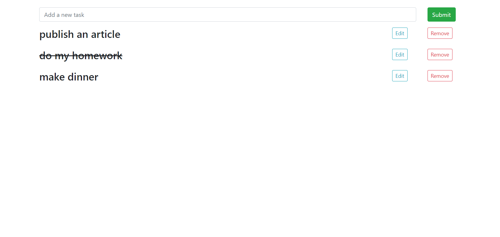
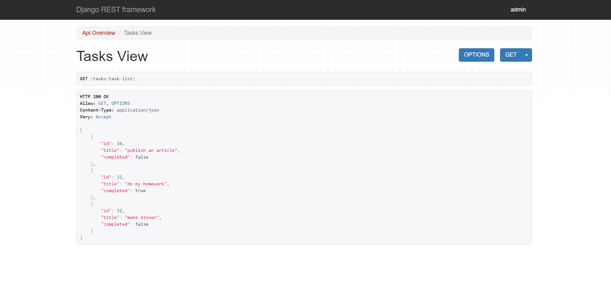

# To-Do (Django Rest Framework)

This is a simple version of To Do app. It is made with Python, Django REST Framework. The front end is handled with the Vanilla JS. Styling is made with Bootstrap. The application allows you to create a quick list of tasks with minimum options:
* Create task
* Edit task
* Delete task
* Cross them out

